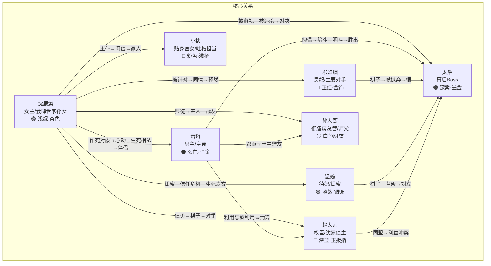

# 本宫想开店 角色圣经

> 本文档为 AI 漫剧《本宫想开店》8 个核心角色提供完整的创作参考，确保 80 集中角色一致性。
> 每个角色包含外在描述、内在四维、语言指纹，主角另含角色弧轨迹。
> 视觉标识关键词可直接用于 AI 生图 prompt。

---

## 沈鹿溪（Shěn Lùxī）

### 外在描述
- **外貌**：瓜子脸偏圆润，杏眼明亮有神，眉毛自然弯弧带英气，鼻梁挺直但不锋利，唇色偏粉润，肤色白皙偏暖黄（江南水乡养出的肤质），身高 163cm，身材匀称偏纤细但手臂有力（常年揉面颠锅练出来的）
- **服装**：入宫前穿素色棉麻衣裙搭鹿溪记围裙；入宫后日常穿浅绿罗裙、杏色褙子，不戴华贵首饰，发间只插一根木簪（爷爷亲手削的）。色系始终偏素雅清淡，在一众华服嫔妃中格外显眼
- **视觉标识关键词**：[light_green, apricot, plain_elegant, wooden_hairpin, linen_apron, warm_skin, bright_eyes]
- **标志性动作/物品**：
  - 思考时无意识地用手指在桌面上比划切菜的动作
  - 紧张或心虚时会摸发间木簪
  - 随身带一块叠得整齐的鹿溪记围裙（藏在袖中），想家时会拿出来闻
  - 看到好食材时眼睛会放光，不自觉凑近闻味道

### 内在四维
- **Want**：出宫回家，继承爷爷的食肆"鹿溪记"，把它开成天下第一食肆
- **Need**：学会在任何环境中活成自己——真正的自由不是逃离牢笼，而是在任何地方都能做自己
- **Flaw**：逃避型人格——遇到无法用"做菜"解决的问题就想跑，把"回家开店"当成逃避一切复杂关系的借口。表面洒脱实则害怕深度羁绊，因为羁绊意味着可能失去
- **Ghost**：8 岁时母亲病逝，父亲沉迷赌博不管她，是爷爷一手带大。爷爷临终前说"鹿溪，守住这间店，别让任何人把你困住"——她把这句话理解为"不要被任何地方、任何人绑住"，从此把"自由=离开"刻进骨子里

### 角色弧轨迹

| 幕 | 集段 | 弧线位置 | 关键转折事件 | 状态描述 |
|----|------|---------|------------|---------|
| 一 | 1-20 | 0% → 25% | 中秋宴后太后说"留在宫里"，彻底走不了 | 从"纯粹想走"到"走不了但有了朋友、师父和一个她还没意识到在意她的人"。逃避本能仍占主导，但牵挂开始萌芽 |
| 二 | 21-40 | 25% → 50% | 萧珩救父条件是"不能再提出宫"；萧珩公开护她"清嫔是朕的人" | 从"想走"到"不确定想不想走了"。第一次为了别人放弃出宫机会，开始意识到有些东西比"回家"更重要，但还不敢承认 |
| 三 | 41-60 | 50% → 80% | 身世真相揭露（爷爷曾是御厨）；萧珩在夺权时机和救她之间选了救她 | 从"被保护的人"成长为"能保护别人的人"。发现爷爷的"别被困住"不是让她逃跑，而是让她不被恐惧困住。开始主动选择留下 |
| 四 | 61-80 | 80% → 100% | 鸿门宴用菜揭秘；拒绝皇后之位，在宫墙边开食肆 | 完成蜕变：不再需要"出宫"来证明自由。在宫墙边开鹿溪记——既没有逃离，也没有被困住，而是用自己的方式活成了自己 |

### 语言指纹
- **节奏**：偏快，句与句之间停顿短，像在赶时间做菜一样利落。激动时语速飙升，一口气能说一长串
- **句长**：中等偏短，口语化，不绕弯子。但涉及美食时会突然变长，滔滔不绝
- **态度**：表面爽朗直接、没心没肺，实际在回避深层话题。一旦话题触及感情或留下的理由，会用做菜的话题岔开
- **词汇特征**：大量食物比喻（"这事儿比发面还难""他那张脸冷得跟冰镇酸梅汤似的"）；偶尔蹦出食肆经营术语（"这成本核算不对""翻台率太低了"）；不用宫廷敬语，经常忘了自称"臣妾"
- **口头禅**：
  - "我不想留在这儿。"（前期，逃避时）
  - "这菜不对。"（品评食物时，也用于隐喻判断局势）
  - "没事儿，做顿饭就好了。"（用做菜回避情感问题时）
- **对白时的小动作**：说谎或心虚时摸发间木簪；认真听别人说话时微微歪头；被触动但不想承认时会低头假装整理衣袖

### 语言指纹变化表

| 触发事件 | 发生集数 | 变化前 | 变化后 |
|---------|---------|-------|-------|
| 萧珩救父，答应不再提出宫 | 33-35 | 频繁说"我不想留在这儿" | 不再主动提出宫，但会说"等这事儿完了再说" |
| 身世真相揭露 | 53-55 | 用做菜岔开深层话题 | 开始正面回应情感问题，偶尔会沉默思考而非立刻岔开 |
| 鸿门宴后决定留下 | 77-80 | "没事儿，做顿饭就好了"（回避） | "没事儿，我做顿饭。"（主动选择，语气从回避变为笃定） |

---

## 萧珩（Xiāo Héng）

### 外在描述
- **外貌**：棱角分明的国字脸，剑眉星目，眼尾微挑带天生的压迫感，瞳色极深近乎墨黑，肤色冷白，身高 183cm，身材修长肩宽，站姿永远笔直如松
- **服装**：日常穿玄色（近黑）龙纹常服，暗金色滚边，腰间系一枚羊脂玉佩（母亲遗物，从不离身）。朝服为正黑龙袍配金冠。极少穿亮色，唯一的暖色是玉佩的乳白
- **视觉标识关键词**：[black, dark_gold, dragon_pattern, jade_pendant, cold_white_skin, sharp_eyes, tall_straight_posture]
- **标志性动作/物品**：
  - 思考或压抑情绪时用右手拇指摩挲腰间玉佩
  - 不高兴时不说话，只是微微抬下巴，眼神变冷
  - 极少笑，笑的时候只有嘴角微动，但眼神会变柔（只在沈鹿溪面前出现）
  - 批阅奏折时习惯用左手撑额

### 内在四维
- **Want**：从太后手中夺回实权，成为真正的皇帝，不再做傀儡
- **Need**：找到一个把他当"萧珩"而非"皇帝"的人——学会信任，学会被人真心对待而不是被利用
- **Flaw**：极度的控制欲和信任障碍——把所有人际关系都当成棋局，习惯用"交易"和"利用"来定义关系，把主动关心别人伪装成"策略需要"
- **Ghost**：12 岁时母亲被太后逼死（对外称病逝）。父皇明知真相却选择沉默。他从那天起明白：在这座宫里，没有人是因为爱你才对你好，所有人都在算计。他发誓要掌控一切，绝不再让任何人有机会伤害他在意的人

### 角色弧轨迹

| 幕 | 集段 | 弧线位置 | 关键转折事件 | 状态描述 |
|----|------|---------|------------|---------|
| 一 | 1-20 | 0% → 25% | 沈鹿溪说"臣妾想回家"，他第一次笑了；中秋宴上看她做菜的眼神 | 从"所有妃嫔都是棋子"到"这个人有点意思"。她是第一个不想靠近他的人，反而让他开始在意。但仍把这种在意归类为"有趣的棋子" |
| 二 | 21-40 | 25% → 50% | 救她父亲，条件是"不能再提出宫"；公开宣示"清嫔是朕的人" | 从"暗中在意"到"公开立场"。救父的条件暴露了他不舍得她走的真心，但他仍用"交易"来包装。公开护她是第一次为了个人感情做出政治冒险 |
| 三 | 41-60 | 50% → 80% | 在夺权时机和救沈鹿溪之间选了救她 | 从"把她当棋局中的变量"到"她比棋局重要"。这是他人生中第一次把一个人放在权力之上。信任障碍开始松动 |
| 四 | 61-80 | 80% → 100% | 想封她为皇后，她拒绝了，在宫墙边开食肆 | 完成蜕变：学会了"不控制"也是一种爱。她不要皇后之位，他便装去吃面——第一次以"萧珩"而非"皇帝"的身份与人相处 |

### 语言指纹
- **节奏**：缓慢，有控制感，每句话之间有明显停顿——像在衡量该说多少。沉默比说话多
- **句长**：极短，命令式。日常不超过八个字。只有在情绪失控时才会说长句（全剧不超过三次）
- **态度**：表面冷淡、居高临下，实际是用距离感保护自己。对沈鹿溪的态度变化轨迹：冷漠审视 → 觉得有趣 → 笨拙的关心（伪装成命令）→ 直接的心疼（不再伪装）
- **词汇特征**：正式、克制，用词精准不多余。偶尔冒出帝王式的措辞（"朕允了""不必多言"）。从不用语气词，从不解释自己的决定
- **口头禅**：
  - "朕知道了。"（万能回应，语气不同含义不同）
  - "随你。"（嘴上说随你，但会默默安排好一切）
  - "这是朕的旨意。"（用来掩饰真心关怀时）
- **对白时的小动作**：想靠近沈鹿溪但克制时，手会抬起一半又放下；听她说做菜时会微微侧头（唯一放松的姿态）；生气时不是提高音量而是声音变得更轻更慢

### 语言指纹变化表

| 触发事件 | 发生集数 | 变化前 | 变化后 |
|---------|---------|-------|-------|
| 公开护她"清嫔是朕的人" | 39-40 | 所有关心都伪装成命令或旨意 | 偶尔会直接表达关切，但仍用极短句（"你没事吧"——对他来说已经是长句了） |
| 选择救她放弃夺权时机 | 59-60 | 从不解释自己的决定 | 第一次对她解释："朕选了你。"（三个字，但是他说过的最长的情感表达） |
| 她拒绝皇后之位 | 78-80 | 用"朕"自称，帝王式措辞 | 便装去吃面时第一次说"我"而非"朕"："我来吃面。" |

---

## 柳如烟（Liǔ Rúyān）

### 外在描述
- **外貌**：鹅蛋脸，柳叶眉，丹凤眼微挑，眼尾一颗小痣增添妩媚，唇色正红，肤色白皙如瓷，身高 168cm，身材丰腴有致，举手投足皆是精心修炼过的优雅
- **服装**：永远穿正红色系华服，金丝绣纹，头戴凤钗（太后赐的，象征她"太后棋子"的身份）。妆容精致浓艳，每一处细节都在说"我是这后宫最尊贵的女人"。倒台后（第45-48集）服装色系从正红变为暗红，金饰减少，凤钗不再佩戴
- **视觉标识关键词**：[crimson_red, gold_ornament, phoenix_hairpin, porcelain_skin, beauty_mark, luxurious, elegant_posture]
- **标志性动作/物品**：
  - 说话时习惯用团扇半遮面，只露出眼睛——既是风情也是防备
  - 生气时不发作，而是微笑着把团扇合上，"啪"一声——这个声音是她发怒的信号
  - 凤钗是她身份的象征，倒台后摘下凤钗的动作是全剧重要的视觉符号

### 内在四维
- **Want**：保住贵妃之位，成为皇后，掌控后宫
- **Need**：摆脱太后的控制，找到属于自己的人生——她从未有过选择的权利
- **Flaw**：把"被需要"等同于"被爱"——为了维持太后对她的"需要"，不惜伤害无辜的人。她以为只要足够有用，就不会被抛弃
- **Ghost**：出身没落世家，14 岁被家族送给太后当棋子。太后对她说"听话，哀家不会亏待你"——这是她人生中第一次被"重视"，从此把服从太后当成唯一的生存法则。她不知道除了当棋子，自己还能是什么

### 语言指纹
- **节奏**：不紧不慢，每个字都像精心挑选过的，带着宫廷贵妇的从容。但在太后面前语速会不自觉加快（紧张的表现）
- **句长**：中等偏长，喜欢用复杂的句式和修辞，说话像在下棋——每句话都有目的
- **态度**：表面温柔端庄、滴水不漏，实际暗藏锋芒。对沈鹿溪的态度从"不屑"到"敌视"到"同病相怜"
- **词汇特征**：用词文雅讲究，擅长用恭维包裹讽刺（"妹妹真是率真，这宫里可不多见呢"）。从不说粗话，最狠的话也说得云淡风轻
- **口头禅**：
  - "妹妹不懂。"（居高临下时）
  - "本宫省得。"（对太后表忠心时）
  - "这后宫啊……"（感慨时，通常接一句意味深长的话）
- **对白时的小动作**：说假话时团扇遮面；真正动怒时合扇"啪"一声；被太后训斥时双手交叠放在身前，指尖微微发白（用力攥着）

### 语言指纹变化表

| 触发事件 | 发生集数 | 变化前 | 变化后 |
|---------|---------|-------|-------|
| 被太后抛弃，倒台 | 45-48 | 说话永远端着，用修辞包裹真实想法 | 开始说短句，不再修饰，偶尔流露疲惫（"够了。""我累了。"） |
| 沈鹿溪送阳春面 | 48 | 对沈鹿溪始终用"妹妹"称呼（居高临下） | 第一次叫她"鹿溪"（平等的称呼），哭着说"你为什么对我好" |

---

## 温婉（Wēn Wǎn）

### 外在描述
- **外貌**：圆润的鹅蛋脸，弯弯的笑眼，眉目温柔如水，肤色白净透粉，身高 160cm，身材娇小柔弱，看起来需要被保护的样子
- **服装**：日常穿淡紫色系衣裙，银饰点缀，风格温柔内敛。手腕上永远戴着一只银镯（母亲留下的，也是她唯一的私人物品）。妆容淡雅，不争不抢的气质从穿着就能看出
- **视觉标识关键词**：[light_purple, silver_ornament, silver_bracelet, soft_eyes, gentle_aura, petite, delicate]
- **标志性动作/物品**：
  - 紧张或内疚时会转手腕上的银镯
  - 笑的时候会用手背轻轻挡一下嘴（宫廷礼仪训练出来的习惯）
  - 深夜独处时会对着银镯发呆（想母亲，也在纠结自己的双重身份）

### 内在四维
- **Want**：在后宫中安稳活下去，不被任何人注意到
- **Need**：有勇气做出自己的选择，而不是永远被别人摆布——无论是太后还是命运
- **Flaw**：讨好型人格——对所有人都好，但没有一个"好"是出于真心的主动选择，全是出于恐惧和求生本能。她不知道自己真正想要什么
- **Ghost**：父亲是太后党的小官，母亲早逝。她从小被教导"听话才能活"，被太后选中安插到后宫监视其他妃嫔。她对沈鹿溪的友谊一开始是任务，后来变成真心——但这份真心让她更加痛苦，因为她知道自己在骗人

### 语言指纹
- **节奏**：轻柔缓慢，像怕吵到别人一样。说话时经常在句尾加轻声语气词
- **句长**：中等，不长不短，温温吞吞。很少说斩钉截铁的话，总是留有余地
- **态度**：永远温和体贴，像一杯温水——不烫不冷，让人舒服但也让人忽略。真正的想法藏得很深
- **词汇特征**：用词柔和，多用"吧""呢""嘛"等语气词软化语气。擅长用关心来回避直接表态（"姐姐先吃点东西吧，别想那么多了"）
- **口头禅**：
  - "姐姐别担心。"（安慰沈鹿溪时，也是在安慰自己）
  - "我没事的。"（明明有事，和沈鹿溪的"没事儿"形成对照——一个是逃避，一个是隐忍）
  - "都听姐姐的。"（讨好模式）
- **对白时的小动作**：说谎时转银镯；真心关心沈鹿溪时会不自觉靠近她；被太后训话后回到自己宫里会蹲在角落抱膝

### 语言指纹变化表

| 触发事件 | 发生集数 | 变化前 | 变化后 |
|---------|---------|-------|-------|
| 秘密暴露（太后棋子身份） | 36-38 | 永远温和，用语气词软化一切 | 沉默增多，说话时不再加语气词，变得生硬（"我知道了。"） |
| 选择背叛太后帮沈鹿溪 | 49-52 | "都听姐姐的"（讨好） | 第一次说出自己的主张："这次，我自己决定。"语气仍轻但不再犹豫 |

---

## 太后（Tàihòu）

### 外在描述
- **外貌**：长脸，颧骨高，眉眼间自带威压，法令纹深刻但不显老态反而增添威严，肤色偏白但不是健康的白而是常年深居宫中的苍白，身高 165cm，身材保养得当，体态端正如一尊佛像
- **服装**：永远穿深紫色系华服，墨金色暗纹，头饰繁复但不花哨——每一件都在彰显权力而非美貌。手中常持一串沉香佛珠，拨珠的速度是她情绪的晴雨表（越慢越危险）
- **视觉标识关键词**：[deep_purple, dark_gold, buddhist_beads, imposing_aura, high_cheekbones, stern_eyes, regal_posture]
- **标志性动作/物品**：
  - 拨佛珠：慢速拨 = 在思考/很危险；快速拨 = 焦躁/失控（全剧仅出现两三次）；停止拨 = 已经做了决定
  - 说话时从不看对方的眼睛，而是看远处或看佛珠——让对方感到自己不值得被正视
  - 唯一会直视对方的时刻是下最后通牒时

### 内在四维
- **Want**：维持对后宫和朝堂的绝对控制，让萧珩永远做听话的傀儡皇帝
- **Need**：放手——她紧握权力的根源是恐惧，害怕一旦放手就会像当年一样被人踩在脚下
- **Flaw**：控制欲的极端化——把所有人都当成棋子，包括自己。她已经分不清"掌控"和"活着"的区别，权力就是她的氧气
- **Ghost**：年轻时是先帝最不受宠的妃嫔，被其他妃嫔欺辱践踏。她靠心机和手段一步步爬到太后之位，代价是失去了所有真心——包括对儿子（萧珩父亲）的母爱。她不是天生的恶人，是这座宫把她变成了这样

### 语言指纹
- **节奏**：极慢，每个字之间都有停顿，像在念经——给人一种"每句话都是圣旨"的压迫感
- **句长**：短句为主，但偶尔会说一段很长的话——那是在讲道理/训人，语气像在教导晚辈
- **态度**：永远居高临下，慈祥和威严交替使用。对听话的人慈祥（"好孩子"），对不听话的人威严（"你在跟哀家说话"）。从不发怒——她的怒气用沉默和微笑表达，比吼叫更可怕
- **词汇特征**：自称"哀家"，用词古雅庄重。擅长用佛家用语包装威胁（"冤孽""因果""放下"）。说"放下"的时候通常是在暗示对方"你该消失了"
- **口头禅**：
  - "哀家老了，管不动了。"（说这话的时候恰恰是在管——反话）
  - "都是哀家的孩子。"（把控制伪装成慈爱）
  - "这宫里的规矩，不是你能改的。"（维护权力时）
- **对白时的小动作**：说话时拨佛珠（速度暗示情绪）；满意时微微点头，幅度极小；不满时停止一切动作，整个人像石像一样静止——这比任何表情都可怕

---

## 赵太师（Zhào Tàishī）

### 外在描述
- **外貌**：方脸，浓眉，三角眼精光内敛，蓄短须修剪整齐，肤色偏黄（常年案牍劳形），身高 175cm，身材中等偏壮，走路时背手踱步，官步稳健
- **服装**：永远穿深蓝色官服，料子考究但不张扬。右手戴一枚玉扳指（价值连城但看起来低调），左手常持一把折扇——扇面是空白的（暗示此人深不可测，不露底牌）
- **视觉标识关键词**：[deep_blue, jade_thumb_ring, folding_fan, shrewd_eyes, trimmed_beard, composed_posture, official_robe]
- **标志性动作/物品**：
  - 折扇是他的"武器"：展开扇子 = 胸有成竹/在表演从容；合上扇子 = 进入正题/要动真格；用扇子点人 = 在威胁
  - 说话时喜欢背手踱步，让对方不得不跟着他的节奏走
  - 笑的时候眼睛眯成一条缝，但笑意从不到达眼底

### 内在四维
- **Want**：利用沈鹿溪扳倒太后，重新洗牌朝堂格局，让自己成为新的权力核心
- **Need**：（他自己不会承认）他需要被人真正尊重而非畏惧——但他已经走得太远，分不清尊重和恐惧的区别了
- **Flaw**：把所有人都当成工具——包括沈鹿溪。他的每一步棋都精准，但精准到冷血的程度。他不是坏人，但他是一个已经被权力异化的人
- **Ghost**：出身寒门，靠科举入仕，一路被世家大族打压排挤。他发誓要爬到所有人头上——而他做到了，代价是变成了和那些打压他的人一样的人

### 语言指纹
- **节奏**：不紧不慢，永远从容，像在下一盘很大的棋。即使局势紧张也不会加快语速
- **句长**：中等偏长，喜欢用典故和比喻，说话像在写奏折——条理清晰但暗藏机锋
- **态度**：表面谦和有礼（"老夫不过一介书生"），实际每句话都在试探和布局。对沈鹿溪的态度从"棋子"到"意外的变数"到"不得不正视的对手"
- **词汇特征**：文人气重，爱引经据典，用词考究。擅长用"为你好"包装利用（"老夫送你入宫，也是为了沈家"）。自称"老夫"，对晚辈称"小友"（看似亲切实则居高临下）
- **口头禅**：
  - "老夫说句不中听的。"（接下来的话一定很中听——因为是在拉拢）
  - "这盘棋啊……"（把一切都比作棋局）
  - "沈家的债，总要有人还的。"（威胁时）
- **对白时的小动作**：展扇/合扇（如上）；说到关键处会停下踱步，转身直视对方；得意时用扇子轻敲掌心

---

## 孙大厨（Sūn Dàchú）

### 外在描述
- **外貌**：圆脸，浓眉大眼，鼻头圆润发红（常年在灶台前被火烤的），络腮胡修剪得不太整齐，肤色偏黑红（厨房热气熏的），身高 170cm，身材敦实壮硕，双手粗大有力但异常灵活
- **服装**：永远穿白色厨衣配灰布围裙，围裙上总有洗不掉的酱汁痕迹。腰间别一把祖传菜刀，刀柄包浆发亮——这把刀跟了他四十年，比任何官印都重要
- **视觉标识关键词**：[white_chef_coat, grey_apron, ancestral_cleaver, ruddy_face, thick_eyebrows, stocky_build, flour_dusted]
- **标志性动作/物品**：
  - 祖传菜刀从不离身，擦刀是他思考问题的方式（相当于太后拨佛珠）
  - 品尝食物时会闭眼，先闻再尝，尝完会沉默三秒再给评价
  - 教沈鹿溪做菜时会拍她后脑勺（师父的习惯性动作，表示"笨"也表示"亲近"）
  - 激动时会拍案板，震得菜刀弹起来

### 内在四维
- **Want**：守住御膳房的尊严和传统，把手艺传给值得的人
- **Need**：放下三十年前的遗憾——他知道沈鹿溪爷爷被逐出宫的真相，但一直不敢说，这个秘密压了他半辈子
- **Flaw**：过度谨慎——在宫中活了四十年，学会了"多做事少说话"，但这种谨慎让他在关键时刻犹豫不决，差点错过帮助沈鹿溪的时机
- **Ghost**：三十年前，他是沈鹿溪爷爷的师弟，两人一起在御膳房学艺。师兄（沈鹿溪爷爷）因为知道了皇室秘密被逐出宫，他目睹了一切却没有站出来——这是他一生的愧疚

### 语言指纹
- **节奏**：说话慢条斯理，像炖汤一样不急不躁。但教训人时语速会突然加快，连珠炮一样
- **句长**：短句为主，朴实直白，不绕弯子。偶尔会说一句很有哲理的话，但马上用粗话把氛围拉回来
- **态度**：表面粗犷严厉（"你这刀工，猪都切不好！"），实际心软如豆腐。对沈鹿溪从"惊为天人"到"当成亲孙女"
- **词汇特征**：大量厨房术语和食物比喻（"火候不到""这事儿还没到起锅的时候"）。自称"老孙"，称沈鹿溪"丫头"。偶尔蹦出粗话但立刻收住（"这他——咳，这不像话"）
- **口头禅**：
  - "火候不到。"（评价做菜，也用于评价时机）
  - "丫头，你这手艺……"（后面接夸奖或批评，取决于语气）
  - "老孙在这御膳房四十年了。"（感慨时，通常是在铺垫要说重要的事）
- **对白时的小动作**：说话时手不停——在擦刀、切菜或擦灶台；夸人时拍对方后脑勺；纠结时反复擦同一个已经很干净的盘子

---

## 小桃（Xiǎo Táo）

### 外在描述
- **外貌**：圆圆的娃娃脸，大眼睛忽闪忽闪，鼻子小巧微翘，嘴巴小但表情丰富（能做出一百种夸张表情），肤色白里透粉，身高 155cm，身材娇小玲珑，看起来比实际年龄小两三岁
- **服装**：穿粉色和浅橘色系的宫女服，比其他宫女多了一分活泼感。腰间挂一个小荷包（里面装着零食和各种"有用的小东西"——针线、药粉、偷听来的八卦纸条）
- **视觉标识关键词**：[pink, light_orange, small_pouch, round_face, big_eyes, petite, lively_expression]
- **标志性动作/物品**：
  - 害怕时会躲到沈鹿溪身后，只露出半个脑袋
  - 吐槽时会双手叉腰，小脸皱成一团
  - 偷听到八卦时会捂嘴，但眼睛瞪得溜圆（完全藏不住表情）
  - 腰间小荷包是百宝袋，关键时刻总能掏出意想不到的东西

### 内在四维
- **Want**：跟着小姐（沈鹿溪）平平安安的，最好能吃好喝好
- **Need**：找到自己的勇气——她不只是"跟班"，在关键时刻她也能独当一面
- **Flaw**：胆小怕事——遇到危险第一反应是躲，嘴上说"小姐我保护你"但腿已经在抖了。她的胆小不是缺点而是真实，但有时会因为胆小而错过帮助沈鹿溪的时机
- **Ghost**：父母是宫中最底层的杂役，从小在宫里长大，见过太多因为"多管闲事"被惩罚的人。她学会了"胆小是活命的本事"——但遇到沈鹿溪后，她第一次想为一个人勇敢

### 语言指纹
- **节奏**：快，连珠炮，一口气能说一长串不换气。激动时语速翻倍，紧张时结巴
- **句长**：长句，废话多但有趣。一件简单的事能说出花来，自带弹幕效果
- **态度**：直接到冒犯但出发点是好的。是沈鹿溪的"嘴替"——说出沈鹿溪不好意思说的话，也说出观众想说的话。对沈鹿溪忠心耿耿，对其他人则是"看人下菜碟"（怕强的、欺软的——但她欺负的"软"也就是嘴上占便宜）
- **词汇特征**：口语化到极致，大量语气词和夸张表达（"天哪""完了完了完了""小姐你疯了吧"）。偶尔蹦出超越时代的吐槽（制造喜剧效果但不出戏）。称沈鹿溪"小姐"（入宫前的称呼，改不过来）
- **口头禅**：
  - "小姐！你又来！"（沈鹿溪作死时的标准反应）
  - "完了完了完了……"（遇到麻烦时的口头禅，通常事情没那么严重）
  - "我跟你说啊——"（开始八卦的信号）
  - "这宫里的人都有病吧？"（吐槽宫斗时）
- **对白时的小动作**：说话时手舞足蹈，表情夸张；害怕时抓沈鹿溪的袖子；偷听时整个人贴在墙上，屁股翘起来（喜剧视觉效果）

### 语言指纹变化表

| 触发事件 | 发生集数 | 变化前 | 变化后 |
|---------|---------|-------|-------|
| 沈鹿溪遇到真正的生命危险 | 59-60 | "完了完了完了"（夸张但不严肃） | 第一次不说话，咬着嘴唇挡在沈鹿溪前面。之后说话时偶尔会冒出认真的短句："小姐，我在。" |

---

# 角色关系图

## 关系矩阵

> 标注每对核心角色之间的关系类型及其在四幕中的演变方向。

| 角色A | 角色B | 关系类型 | 第一幕（1-20集） | 第二幕（21-40集） | 第三幕（41-60集） | 第四幕（61-80集） |
|-------|-------|---------|----------------|-----------------|-----------------|-----------------|
| 沈鹿溪 | 萧珩 | 作死对象→心动→生死相依→伴侣 | 互不理解，她想逃他觉得有趣 | 暗生情愫，他频繁来"品菜"，她以为他嘴馋 | 生死相依，他为她放弃夺权时机 | 并肩作战，她拒绝皇后他便装吃面 |
| 沈鹿溪 | 柳如烟 | 被针对→对手→同情→释然 | 被柳如烟视为眼中钉，单方面敌视 | 正面冲突升级，柳如烟联合孤立她 | 柳如烟倒台，沈鹿溪送阳春面，同情理解 | 各自释然，不再是敌人 |
| 沈鹿溪 | 温婉 | 闺蜜→信任危机→重建→生死之交 | 温婉主动接近，成为唯一朋友 | 温婉秘密暴露（太后棋子），信任崩塌 | 温婉背叛太后帮她，友谊经受考验后重建 | 真正的生死之交，不再有秘密 |
| 沈鹿溪 | 太后 | 被审视→被利用→被追杀→对决 | 太后觉得她"不做作"，暂时容忍 | 太后开始将她视为威胁，设局要废她 | 太后要杀她灭口 | 鸿门宴正面对决，用菜揭秘 |
| 沈鹿溪 | 赵太师 | 债主→幕后操控→棋子→对手 | 赵太师送她入宫，她只知道是"还债" | 赵太师发难抓她父亲，暴露更深目的 | 身世线揭露赵太师与爷爷的渊源 | 赵太师真正目的暴露，她不再是棋子 |
| 沈鹿溪 | 孙大厨 | 陌生→师徒→亲人→战友 | 孙大厨发现她的厨艺天赋，收为徒弟 | 师徒关系深化，孙大厨教她宫廷菜 | 孙大厨揭露身世线索，亦师亦祖 | 御膳房变情报中心，师徒变战友 |
| 沈鹿溪 | 小桃 | 主仆→闺蜜→家人 | 小桃被分配为她的宫女，从害怕到忠心 | 小桃成为她在宫中最亲近的人 | 小桃第一次为她挡在前面 | 小桃独当一面，从跟班变成伙伴 |
| 萧珩 | 柳如烟 | 君臣→疏离→无关 | 客气但疏离，柳如烟是太后安排的棋子 | 萧珩对柳如烟的针对沈鹿溪不满 | 柳如烟倒台，萧珩未施援手也未落井下石 | 无直接交集 |
| 萧珩 | 温婉 | 君臣→怀疑→认可 | 知道温婉是太后的人，保持距离 | 温婉秘密暴露后，萧珩对她更加警惕 | 温婉背叛太后后，萧珩开始认可她 | 温婉成为可信任的盟友 |
| 萧珩 | 太后 | 傀儡→暗斗→明斗→胜出 | 表面恭顺，暗中布局 | 权谋线开始正面冲突 | 权斗白热化，萧珩为救沈鹿溪暴露实力 | 最终决战，太后倒台，萧珩掌权 |
| 萧珩 | 赵太师 | 利用与被利用→对手→清算 | 赵太师是太后党，萧珩暗中观察 | 赵太师发难，萧珩被迫提前出手 | 赵太师的立场开始模糊 | 赵太师真正目的暴露，萧珩清算 |
| 萧珩 | 孙大厨 | 君臣→暗中盟友 | 萧珩因沈鹿溪注意到御膳房 | 孙大厨成为萧珩了解沈鹿溪的窗口 | 孙大厨提供身世线关键信息 | 御膳房情报中心，孙大厨是核心成员 |
| 柳如烟 | 太后 | 棋子→被抛弃→恨 | 柳如烟是太后最听话的棋子 | 太后开始对柳如烟不满 | 太后抛弃柳如烟，换更听话的棋子 | 柳如烟对太后的恨成为沈鹿溪的助力 |
| 柳如烟 | 温婉 | 同僚→竞争→无交集 | 同为太后棋子，表面和平 | 柳如烟拉拢温婉孤立沈鹿溪 | 柳如烟倒台后与温婉无交集 | 无直接交集 |
| 温婉 | 太后 | 棋子→背叛→对立 | 温婉是太后安插的眼线 | 温婉在太后和沈鹿溪之间左右为难 | 温婉选择背叛太后，付出代价 | 温婉站在沈鹿溪和萧珩一边 |
| 孙大厨 | 太后 | 臣属→隐忍→对抗 | 孙大厨在御膳房低调生存 | 孙大厨暗中保护沈鹿溪 | 孙大厨揭露身世线，间接对抗太后 | 御膳房成为对抗太后的情报中心 |

## 关系图（Mermaid）

---

# 视觉标识速查表

> 供 AI 生图 prompt 快速引用。

| 角色 | 色系 | 标志性配饰 | 气质关键词 | Prompt 标签组合 |
|------|------|----------|----------|---------------|
| 沈鹿溪 | 浅绿、杏色、素雅 | 鹿溪记围裙、发间木簪 | 清新、灵动、烟火气 | light_green dress, apricot, wooden_hairpin, plain_elegant, bright_eyes, warm_skin |
| 萧珩 | 玄色、暗金、龙纹 | 腰间玉佩（母亲遗物） | 冷峻、威严、深不可测 | black robe, dark_gold trim, dragon_pattern, jade_pendant, sharp_eyes, tall_straight_posture |
| 柳如烟 | 正红、金饰、华贵 | 凤钗 | 妩媚、精致、暗藏锋芒 | crimson_red dress, gold_ornament, phoenix_hairpin, beauty_mark, porcelain_skin, luxurious |
| 温婉 | 淡紫、银饰、温柔 | 手腕银镯 | 柔弱、温和、内敛 | light_purple dress, silver_ornament, silver_bracelet, soft_eyes, gentle_aura, petite |
| 太后 | 深紫、墨金、威严 | 佛珠 | 威压、不怒自威、如佛似魔 | deep_purple robe, dark_gold pattern, buddhist_beads, imposing_aura, stern_eyes, regal_posture |
| 赵太师 | 深蓝、玉扳指 | 折扇 | 老谋深算、从容不迫 | deep_blue official_robe, jade_thumb_ring, folding_fan, shrewd_eyes, composed_posture |
| 孙大厨 | 白色厨衣、灰布围裙 | 祖传菜刀 | 粗犷、朴实、手艺人 | white_chef_coat, grey_apron, ancestral_cleaver, ruddy_face, stocky_build, flour_dusted |
| 小桃 | 粉色、浅橘、活泼 | 腰间小荷包 | 可爱、夸张、元气满满 | pink dress, light_orange, small_pouch, round_face, big_eyes, lively_expression |